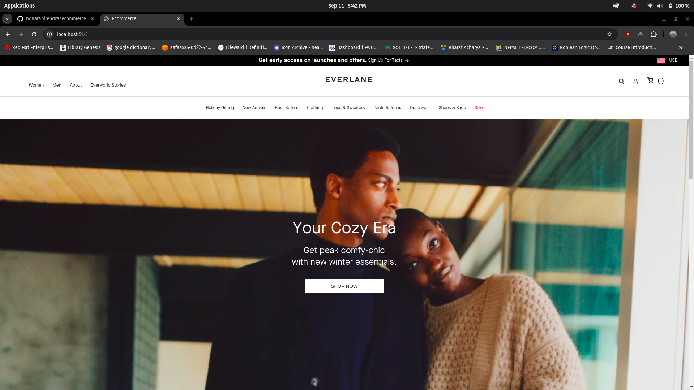
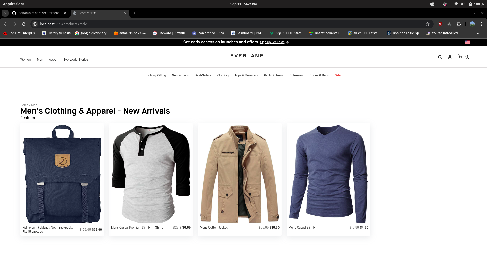
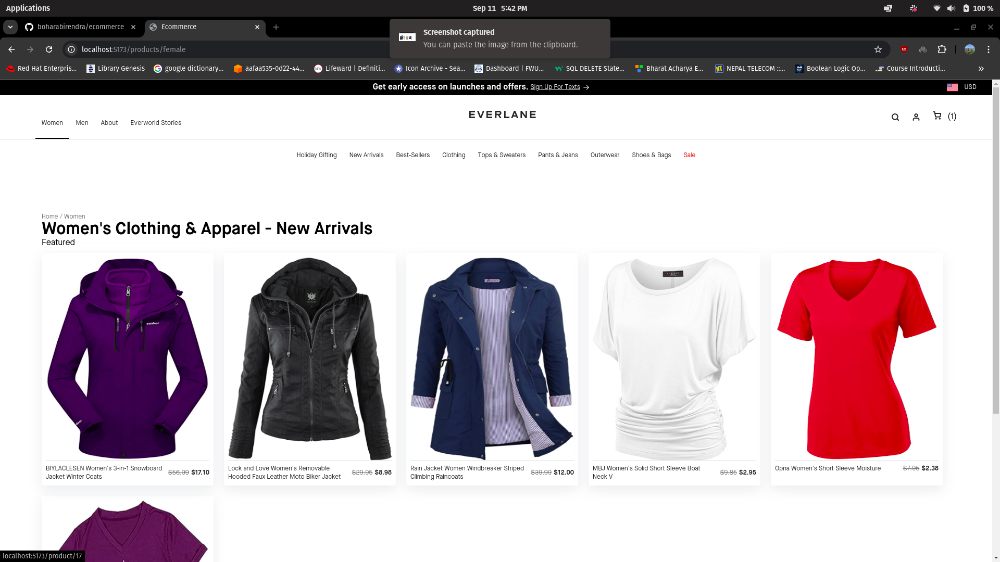
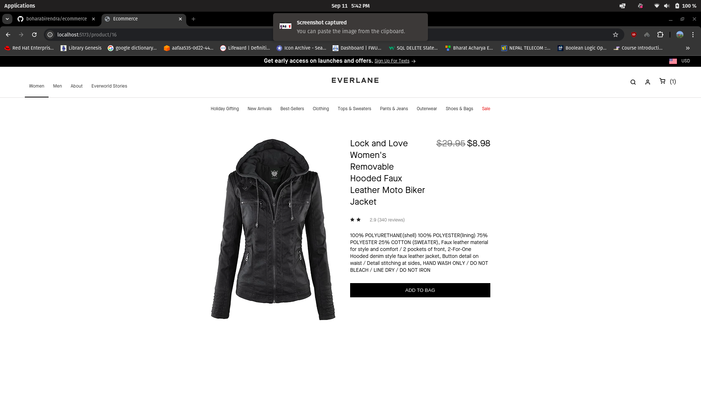
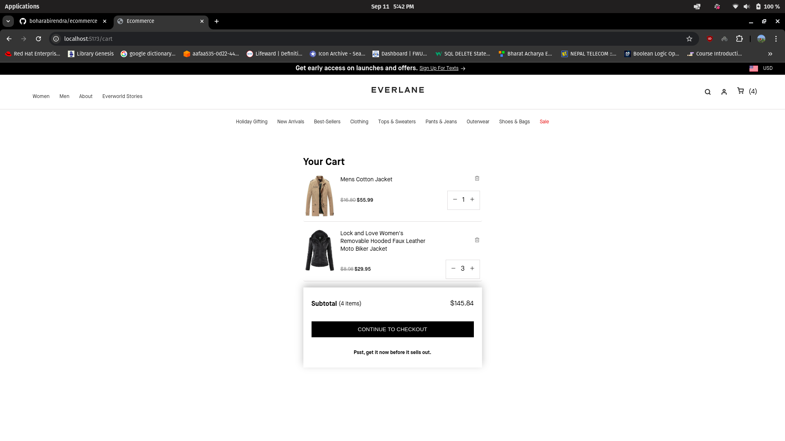

# E-commerce app

- this website lets user to buy products
- user can filter products by categories (Man's or Women's)
- it is mobile responsive

## Technology used

- React for UI
- HTML
- Redux toolkit for state management
- SCSS for styling
- Typescript
- React router dom package for managing routing

## here are some screenshot

